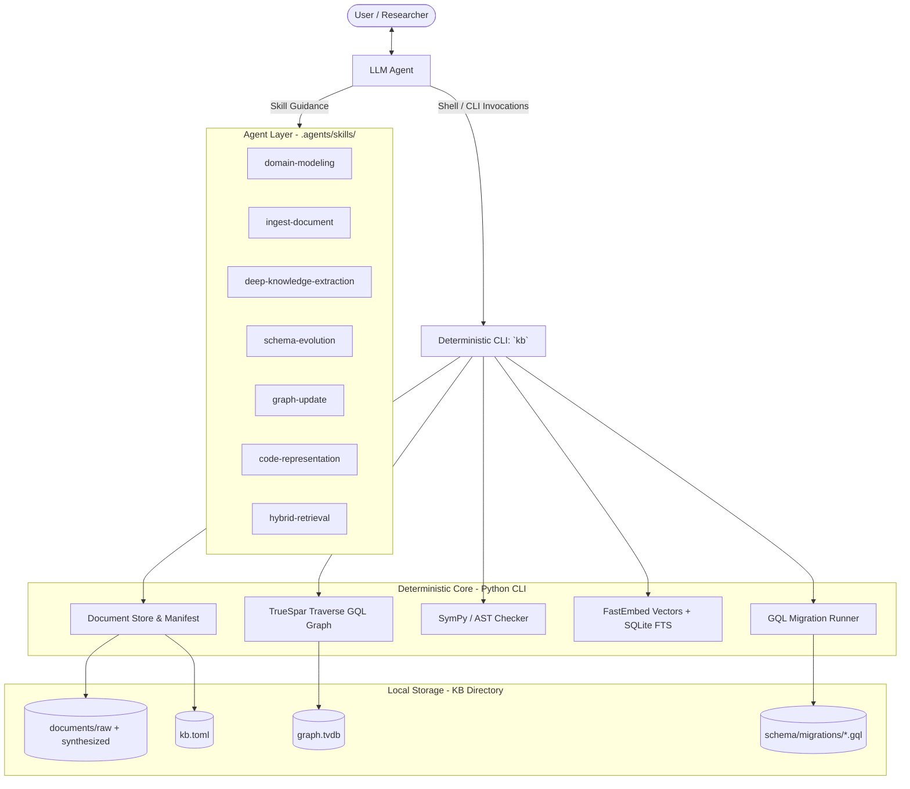

# System Design and Architecture Overview

## 1. Vision & Core Philosophy

`yagrag` (Yet Another GraphRAG) is a lightweight, local-first system designed for building, evolving, and maintaining **domain-specific property-graph databases coupled with document stores**.

Traditional GraphRAG approaches often treat the graph merely as an index of document-to-document citations or high-level entity co-occurrences. In contrast, `yagrag` adopts a **Wikidata, not Wikipedia** philosophy:
- **Domain Internals**: The graph captures fine-grained structured knowledge embedded *inside* scientific and technical papers: models, equations, mathematical quantities, algorithms, assumptions, claims, tasks, and problems.
- **Reified Claims & Provenance**: Claims carry explicit provenance (`origin`, `sources`, `confidence`, `predicate`, `object_literal`). Potentially conflicting findings across literature can coexist without corrupting graph consistency.
- **Statically Checkable Formalisms**: Formal artifacts (SymPy formulas, reference Python implementations) link directly to symbolic graph nodes and can be checked automatically (`kb code check`, `kb math show`).

---

## 2. The Architectural Boundary: Deterministic CLI vs. Agent Reasoning

A fundamental design invariant of `yagrag` is the strict separation between deterministic graph/document mechanics and stochastic LLM reasoning:



- **Deterministic CLI (`kb`)**: Implemented in Python. Zero internal LLM calls. Fully testable, deterministic, scriptable offline, and environment-independent.
- **Agent Layer**: LLM instructions and procedural workflows defined as modular `SKILL.md` files adhering to the open [Agent Skills](https://agentskills.io) standard (`.agents/skills/`). The agent interviews users, synthesizes documents, extracts entities, and formulates graph updates by invoking `kb`.

---

## 3. Storage & Workspace Structure

A knowledge base is a self-contained filesystem directory managed by `kb.toml`:

```text
<kb-root>/
├── kb.toml                 # Format version, paths, and embedding configuration
├── documents/
│   ├── raw/                # Immutable original sources (PDFs, Markdown, text)
│   ├── synthesized/        # Agent-generated summaries and literature reviews
│   └── manifest.json       # Document catalog, hashes, DOIs, and URLs
├── schema/
│   ├── migrations/         # Numbered GQL migrations (e.g. 0001_seed_domain.gql)
│   └── companion.json      # Schema metadata (canonical edge directions, semantics)
├── code/
│   ├── equations/          # .sympy formulas corresponding to Equation nodes
│   └── algorithms/         # .py reference implementations for Algorithm nodes
└── graph.tvdb              # Embedded TrueSpar Traverse property-graph database
```

### 3.1. Provenance & Origins
Every node and edge written to the graph must carry an `origin` and a non-empty `sources` array (referencing document IDs or external entity IRIs):
- `raw`: Directly extracted from ingested source material.
- `synthesized`: Formulated through agent synthesis or meta-analysis.
- `inferred`: Derived via automated graph reasoners or semantic transitivity.
- `mardi`: Seeded or aligned from external scientific ontologies (e.g. MaRDI MathModDB / MathAlgoDB).

---

## 4. Graph Engine & Schema Architecture

### 4.1. Embedded Database: TrueSpar Traverse
`yagrag` uses **TrueSpar Traverse** (`graph.tvdb`) as its primary embedded property graph engine:
- Standards-compliant ISO GQL / OpenCypher querying.
- Fast ACID transactions with zero daemon setup required.
- Graph exploration via built-in Studio UI (`traverse-server --data <kb-dir>`).

### 4.2. Versioned GQL Migrations
Schema changes are managed via forward-only numbered `.gql` migration files:
- `0001_seed_domain.gql`: Base entity types (`Document`, `Concept`, `Method`, `Model`, `Equation`, `Quantity`, `Claim`, `Assumption`, etc.).
- `0002_add_missing_relations.gql`: Expanded structural edge types.
- `0003_symbolic_equation_relations.gql`: Deep links between `Equation`, `Quantity`, and `Symbol`.
- `0004_add_acronym_support.gql`: Polysemy disambiguation via `Acronym`, `USES_ACRONYM`, and `STANDS_FOR`.
- `0005_mardi_alignment.gql`: Integration with Mathematical Research Data Initiative (MaRDI) ontology.

The schema companion (`schema/companion.json`) enforces canonical edge directions, preventing reversed or hallucinated relationship topologies during agent extraction.

---

## 5. Mathematical & Algorithmic Grounding

A key differentiator of `yagrag` is static verifiability of equations and code:
- **SymPy Consistency**: Equation nodes link to `.sympy` expressions. The CLI verifies that mathematical symbols in the formula match connected `Quantity` nodes in the property graph (`kb math show`, `kb math glossary`).
- **AST / Linter Checking**: Algorithms link to executable `.py` snippets verified with Python AST validation and `ruff` linting (`kb code check`).
- **Equation Auditing**: The graph audit tool (`kb graph lint`) scans equations against connected symbols to ensure symbols appearing in LaTeX expressions have corresponding graph representations.

---

## 6. Document Store, Provenance & Citation Engine

- **Immutable Ingestion**: Source files added via `kb doc add` are stored immutably with SHA-256 integrity checks recorded in `manifest.json`.
- **Traceability & DOI Requirement**: To enable remote re-retrieval and lightweight repository distribution without committing copyright-restricted raw document binaries (`kb doc fetch`), raw documents require a DOI (`--doi`) by default. Users working with internal or unpublished documents can bypass this using `--no-doi` (or by setting `require_doi = false` in `kb.toml`).
- **Text Extraction**: Transparent conversion of PDF and Markdown sources into clean text for chunking and search.
- **Citation Linking**: In-text citations (e.g., `\cite{...}`, DOIs, markdown links) are parsed and resolved to `Document` nodes with `CITES` edges in the graph (`kb doc cite`).
- **Remote Synchronization**: Metadata manifests reference remote DOIs and file URLs, allowing lightweight repository distribution without committing copyright-restricted raw document binaries (`kb doc fetch`, `kb graph dump`, `kb graph restore`).

---

## 7. Hybrid Retrieval Engine

Retrieval fuses three complementary retrieval techniques into unified context bundles (`kb search "<query>"`):
1. **Vector Dense Retrieval**: Semantic text search using embedded fast models (`fastembed`).
2. **Lexical Full-Text Search (BM25 / FTS)**: Keyword-exact matching on document chunks.
3. **Graph Traversal & Subgraph Expansion**: Multi-hop neighbor exploration around retrieved entities, resolving incoming/outgoing relationships, reified claims, acronym expansions, and mathematical formulas into coherent context bundles for LLM prompts.

---

## 8. Historical Reference

For the original bootstrap roadmap, user stories, and initial development notes from the project's inception, refer to [Historical Design & Bootstrap Plan](design_and_architecture_historical.md).
