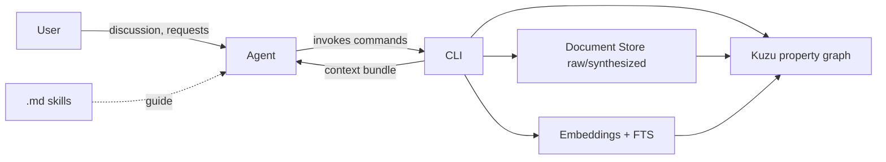

# Requirements

### Overview & Goals
Build a **lightweight, local-first GraphRAG system** for creating and maintaining *domain-specific property-graph databases plus document collections*. It helps organize knowledge and source material in a research area, with most building/maintenance work driven by an LLM agent (Junie).

The system separates two layers:
- **A deterministic CLI** (`kb`) that performs all document-store and graph-database operations. No LLM calls inside the CLI.
- **An agent layer** made of `.md` skill/instruction files that tell the agent *how* to interview the user, model the domain, ingest & analyze documents, evolve the schema, update the graph, synthesize documents, and answer questions — all by calling the CLI.

**Knowledge-graph philosophy — Wikidata, not Wikipedia.** The graph is intended to capture *structured domain knowledge that lives inside documents* (concrete concepts, methods, variables, factors, models, equations, assumptions, claims, and quantities and how they relate), not merely bibliographic relations *between* documents. Think of a Karpathy-style domain wiki where most of the content is held in a **rich, deeply domain-specific entity–relation schema** rather than in prose. Documents remain first-class (as source/provenance and as synthesized outputs), but they are one layer on top of a much deeper domain-knowledge layer.

The first target domain is **sensor fusion & model-based control (esp. factor graphs)**, with practical application to **skid-drive UGVs doing navigation and photogrammetry**, and an emerging interest in **world models**.

### Scope
**In Scope (initial version)**
- Repository scaffold + installable Python CLI.
- Filesystem document store with strict separation of **raw ingested** vs **synthesized** documents, plus provenance metadata.
- Embedded **property-graph database** (Kuzu) with a versioned, evolvable schema.
- A **two-layer graph schema**: (1) a general **document/bibliographic layer** (documents, authors, citations, provenance) and (2) a **deep, domain-specific knowledge layer** that models the internals of the domain (Wikidata-style structured facts and claims).
- Deterministic CLI commands for: init, schema management, document management, graph upsert/query, indexing (embeddings + full-text), and hybrid retrieval.
- Agent skill `.md` files covering the full workflow (domain modeling → ingest → deep knowledge extraction → schema evolution → graph update → synthesis → Q&A).
- A **rich seed domain model/schema** for sensor fusion / factor graphs / UGV navigation & photogrammetry that captures domain internals (variables, factors, estimators, sensor/motion models, claims), not just document structure.
- **Native document formats: Markdown/text + PDF.** HTML is handled via a short **agent howto** (a `.md` skill) that explains how to save a web page in a digestible form (clean Markdown/text) before ingesting it — *not* via a native HTML parser in the CLI.

**Sequencing:** the initial effort is **foundations-first** — get the scaffold, store, graph/schema, and retrieval in place before layering on the LLM-driven extraction/synthesis skills.

**Out of Scope (initial version)**
- Native HTML/webpage parsing inside the CLI (handled by an agent howto that saves pages as clean Markdown/text first).
- A web UI or hosted service (personal/local use first; sharing online is a later concern).
- Automated document *acquisition* from the web (documents are provided/pointed to by the user).
- Multi-user access control / auth.
- Heavy MLOps (model training, fine-tuning).

### User Stories
- As a researcher, I want to discuss a topic with the agent and get an **initial, deep domain model/schema** so the knowledge base starts structured with domain-specific entity and relation types.
- As a researcher, I want to **ingest documents** (PDF/Markdown/text) and have them stored immutably as raw source with metadata.
- As a researcher, I want the agent to **extract the structured knowledge *inside* a document** — the concrete domain entities, their properties, and the claims/relations asserted — and add them to the graph, respecting the existing schema (Wikidata-style facts, not just a document summary).
- As a researcher, I want the agent to **extract entities and relations** from a document and add them to the graph, respecting the existing schema.
- As a researcher, I want the agent to **propose schema extensions/revisions** when new topics or new kinds of domain entities/relations appear, and apply them safely.
- As a researcher, I want the agent to **synthesize summary/overview documents** kept clearly separate from raw sources, with links back to their sources.
- As a researcher, I want to **ask questions** and get answers grounded in graph facts + references to raw/synthesized documents.

### Functional Requirements
- The graph captures **domain internals**: entities extracted from within documents (concepts, methods, variables, factors, models, equations, assumptions, quantities) and the **claims/relations** asserted about them — not just document-to-document links.
- Claims/facts are represented so they can carry qualifiers and provenance (e.g. a reified `Claim`/statement pattern) enabling potentially conflicting assertions from different sources to coexist and be reconciled by the agent.
- The schema is **layered**: a general document/bibliographic layer and a deep domain-knowledge layer, connected by `MENTIONS`/`DEFINES`/`SUPPORTS` edges from documents to domain entities and claims.
- Every graph node/edge and every fact carries **provenance** (source document id(s), raw-vs-synthesized origin, extraction confidence/notes).
- Raw documents are **immutable** once ingested; synthesized documents live in a separate tree and record their source nodes/documents.
- Schema is **explicit, versioned, and migratable**; the CLI validates data against it and applies schema changes as tracked migrations.
- Retrieval supports **hybrid** access: graph/Cypher queries, vector (semantic) search, and full-text search, returning a context bundle (facts + document references) for the agent to answer from.
- The CLI is **scriptable and non-interactive** (stable exit codes, JSON output option) so the agent can call it reliably.

### Milestone 2 — Machine-checkable mathematics & algorithms (Stage 0)

**Motivation.** Today the only formal content in the schema is `Equation.latex`. LaTeX is presentation-only: nothing can check its *meaning*. Equations and algorithms should instead be stored in **programming-language syntax** so the agent's existing tools (parsers, linters, static analyzers) can check them **without a round-trip to the LLM**.

**Confirmed standardization**
- **Mathematics** — keep `latex` for display fidelity to the source, and add a **SymPy-parseable canonical expression** as the checkable representation.
- **Algorithms** — standardize on a **single language: Python 3.11 + NumPy**. Same language as the CLI, so the checkers ship with the environment and there is no extra toolchain.
- **Storage** — **files only**: every snippet lives as a real file under a `code/` tree in the KB and is referenced by `code_path`. No inline code property. Real files are what `ruff` wants and what `git diff` can version.
- **Schema delivery — edit the seed migration, do not add an ALTER migration.** No knowledge base built with this tool is being preserved yet: every KB in the repo (tests, `examples/factor-graph-slam/`) is created from scratch by a script, so there is nothing to migrate. The code-bearing properties are therefore added **directly to `schema/migrations/0001_seed_domain.json`**, and an `add_node_property` migration operation is deferred until a real KB needs to survive a schema change.
- **Checking depth** — syntax gate (`ast.parse` / `sympy.sympify`), **symbol consistency** against `Quantity.symbol` / `Variable` nodes in the graph, and **`ruff check`** on Python snippets when ruff is available. Mypy is deliberately excluded for now (slow and noisy for short numerical code).
- **Failure handling** — a failed check **never blocks a write**. The result is recorded as data (`code_status`) on the node, so retrieval can surface or filter unverified facts.
- **No execution in Stage 0.** `kb code check` never runs stored code; therefore no sandbox is required yet.

**Hard rule:** executability is never a precondition for ingesting knowledge. An equation with only LaTeX remains a valid, useful node; the code representation is an *enrichment* with its own status, so extraction never stalls because the agent could not write checkable code.

**Roadmap beyond Stage 0 (documented, not implemented)**
- *Stage 1* — opt-in `kb code run` in a local subprocess with `resource` limits, wall-clock timeout, temp cwd, no network, whitelisted imports. Soft isolation only.
- *Stage 2* — container/VM sandbox (pinned image, `--network=none`, read-only rootfs, dropped capabilities), also serving as the home for the agent's own shell scripts.
- *Stage 3* — verification as data: a `Check` node (inputs, expected output, tolerance) linked by `VERIFIES` to an `Equation`/`Algorithm`, turning the KB into a reproducible regression suite.

### Non-Functional Requirements
- **Local-first & offline-capable**: no mandatory external services for core operation.
- **Portable**: a knowledge base is a self-contained directory (docs + DB + schema + config) that can be zipped/shared.
- **Reproducible**: deterministic CLI behavior; schema and migrations under version control.
- **Extensible**: pluggable embedding backend (local model or API) and support for future additional domains.

# Technical Design

### Current Implementation
Milestone 1 is complete. The repo contains the `kb` Python package (`store`, `graph`, `schema`, `index`, `cli`), a Kuzu-backed graph with a layered seed schema in `schema/migrations/0001_seed_domain.json` (29 node types, 28 relation types incl. reified `Claim`), eight agent skills in `.junie/skills/`, a worked example in `examples/factor-graph-slam/`, and a green test suite (73 tests).

Relevant limitations for Milestone 2:
- `Equation` is the only type with formal content (`latex`); `Method`, `Algorithm`, `MotionModel`, `SensorModel`, `NoiseModel` and `Factor` carry no formal representation at all.
- `kb/schema/model.py` supports only three migration operations — `create_node_table`, `create_rel_table`, `cypher` — so there is no structured way to add a property to an *existing* table. **This does not block Milestone 2**: since no long-lived KB exists yet, the new properties go straight into the seed migration `schema/migrations/0001_seed_domain.json`, and any KB is simply rebuilt. An `add_node_property` / `ALTER TABLE` operation is deliberately postponed until a KB worth preserving exists.

### Key Decisions (please confirm)
- **Graph database: Kuzu (embedded).** Cypher query language, built-in `vector` and `fts` (full-text) extensions, Python/C++/Rust bindings, no server process, single on-disk database directory. Ideal for a portable personal GraphRAG. *Alternatives: Neo4j (server, heavier) or plain JSON/YAML files (loses query power).*
- **CLI language: Python 3.11+.** Richest LLM/graph tooling and one of your primary languages. Packaged with `uv`/`pyproject.toml`; CLI built with **Typer** + **Rich**; models/config via **pydantic**. *Rust is a good later option for a performance-critical core.*
- **LLM lives in the agent, not the CLI.** The CLI is fully deterministic (store + DB + retrieval). All reasoning (interviewing, extraction, schema proposals, synthesis, answering) is done by the agent following `.md` skills that invoke the CLI. This keeps the tool testable and harness-agnostic.
- **Document store = filesystem + manifest.** Markdown/text with YAML front-matter for metadata; PDFs stored as-is with a sidecar `.meta.json`. A `documents/` tree split into `raw/` and `synthesized/`; a manifest index (SQLite or JSON) tracks ids, hashes, provenance.
- **Embeddings: pluggable, local by default.** Default local embedder (e.g. `fastembed`/`sentence-transformers`); optional API backend selectable via config. Vectors stored in Kuzu via the vector extension.
- **Code-bearing nodes carry a uniform property set (Milestone 2).** `code_language` (`python` | `sympy`), `code_path` (file under `code/`), `code_entry` (callable/expression entrypoint), and the check result as data: `code_status`, `code_checked_at`, `code_checker`, `code_hash`. `latex` remains on `Equation` unchanged.
- **`kb code` is deterministic and non-executing.** It parses, lints and cross-checks symbols against the graph, then writes the status back. Deciding *what* code to write and how to fix a failure stays in the agent — the CLI/agent boundary is unchanged.
- **Provenance is first-class.** Every node/edge stores `sources` (document ids), `origin` (raw|synthesized|inferred), and `confidence`; a `Document` node + `MENTIONS`/`DERIVED_FROM` edges tie graph content back to documents.
- **Layered, deep domain schema (Wikidata-style).** The schema has two connected layers: a *document/bibliographic layer* (general, reusable across any research topic) and a *domain-knowledge layer* (rich, domain-specific types that model the internals of the field). Claims are **reified** as `Claim`/statement nodes (subject–predicate–object plus qualifiers, sources, and confidence) so structured facts — including competing ones — are captured explicitly rather than flattened into prose. This is the core distinction from a generic document-graph: the knowledge, not just the documents, is structured.

### Proposed Changes
Create a single self-contained repository that is **both** the CLI tool and an example knowledge base (can be split later). Core packages:
- `kb/store/` — document store (raw/synthesized), manifest, hashing, front-matter parsing, PDF/text extraction.
- `kb/graph/` — Kuzu connection wrapper, schema loader/validator, migration runner, node/edge upsert helpers, Cypher execution.
- `kb/schema/` — schema definition model (types, properties, relations) + migration files.
- `kb/index/` — embedding backends + FTS index build; hybrid retrieval (Cypher + vector + FTS) producing a context bundle.
- `kb/cli/` — Typer command groups wiring the above; `--json` output mode for agent consumption.
- `.junie/skills/` (or `skills/`) — agent instruction `.md` files.

### Data Models / Contracts
The starter schema is organized into **two connected layers**.

**Layer 1 — Document / bibliographic layer (general, reusable):**
- Node types: `Document`, `Paper`, `Author`, `Venue`.
- Relation types: `CITES`, `AUTHORED_BY`, `PUBLISHED_IN`, `MENTIONS` (Document→domain entity), `DEFINES` (Document→domain entity), `SUPPORTS`/`CONTRADICTS` (Document→`Claim`), `DERIVED_FROM` (synthesized Document→sources).

**Layer 2 — Deep domain-knowledge layer (rich, sensor-fusion / factor-graph / UGV specific):**
- Core knowledge nodes: `Concept`, `Method`, `Algorithm`, `Model`, `Assumption`, `Equation`, `Quantity`, `Metric`, `Dataset`, `Tool`, `Application`, `System`.
- Domain-specific nodes (capturing document internals): `FactorGraph`, `Variable`, `Factor`, `StateEstimator`, `MotionModel`, `SensorModel`, `Sensor`, `Optimizer`/`Solver`, `Constraint`, `CoordinateFrame`, `Robot`, `Task`, `NoiseModel`.
- Domain relation types: `RELATES_TO`, `PART_OF`, `SPECIALIZES`, `USES`, `IMPLEMENTS`, `APPLIES_TO`, `HAS_VARIABLE`, `HAS_FACTOR`, `CONNECTS` (Factor→Variables), `ESTIMATES` (Estimator→Variable/Quantity), `MEASURES` (Sensor→Quantity), `ASSUMES` (Method→Assumption), `MINIMIZES`/`OPTIMIZES`, `SOLVED_BY`, `DEFINED_BY` (entity→Equation), `EVALUATED_ON` (Method→Dataset/Metric).

**Claim/statement layer (Wikidata-style reification):**
- `Claim` node: `subject` (→ entity), `predicate` (string/controlled), `object` (→ entity or literal), plus `qualifiers`, `sources`, `confidence`, `origin`. Edges: `ABOUT` (Claim→subject), `HAS_OBJECT` (Claim→object), `SUPPORTS`/`CONTRADICTS` (Document→Claim). This lets structured, potentially conflicting facts coexist with full provenance.

**Common properties (all nodes/edges):** `id`, `name`, `summary`, `origin` (raw|synthesized|inferred), `sources` (list of doc ids), `confidence`, `created_at`, `updated_at`.

The schema definition format (in `schema/`) is expressive enough to declare per-node-type properties and typed relations, so the agent can **grow the domain layer** by adding new node/relation types via tracked migrations.

**CLI surface (deterministic):**
- `kb init` — scaffold a knowledge base directory (docs tree, DB, schema, config).
- `kb schema show|validate|apply|migrate` — manage the versioned schema.
- `kb doc add|list|show|remove` — manage documents; `--kind raw|synthesized`; records provenance.
- `kb graph upsert-node|upsert-edge|upsert-claim|query|export` — property-graph writes/reads (domain entities + reified claims) via Cypher.
- `kb index build` — generate embeddings + full-text index.
- `kb search|retrieve` — hybrid semantic/graph/FTS retrieval returning a JSON context bundle (facts + document refs).
- `kb code list|show|check` *(Milestone 2)* — inventory code-bearing nodes and their status; print a snippet's source; statically check snippets and persist the result.

**Milestone 2 contracts:**

The code-bearing property set is declared inline in the existing seed migration — no new migration operation is introduced:
```jsonc
// schema/migrations/0001_seed_domain.json (edited in place)
{ "op": "create_node_table",
  "table": { "name": "Equation",
    "properties": [
      { "name": "latex",        "type": "STRING" },
      { "name": "code_language","type": "STRING" },  // "python" | "sympy"
      { "name": "code_path",    "type": "STRING" },
      { "name": "code_entry",   "type": "STRING" },
      { "name": "code_status",  "type": "STRING" },  // ok | failed | unchecked
      { "name": "code_checked_at", "type": "STRING" },
      { "name": "code_checker", "type": "STRING" },
      { "name": "code_hash",    "type": "STRING" } ] } }
```
```
kb code list [--status ok|failed|unchecked] [--json]
kb code show <Label>:<id>
kb code check [--label L] [--id ID] [--lint] [--json]
```
`code_status` values: `ok` | `failed` | `unchecked`. `kb code check` exits non-zero only on *invocation* errors, not on snippet failures (the failures are data).

### File Structure
```
<repo root>
  pyproject.toml            # uv/PEP 621 project + CLI entry point `kb`
  kb.toml                   # KB config: db path, embedder backend, paths
  README.md
  kb/                       # Python package (store, graph, schema, index, cli)
  schema/                   # schema definition + migrations/*.cypher|*.yaml
  code/                     # Milestone 2: stored snippets (*.py) referenced by code_path
  documents/
    raw/                    # immutable ingested sources (+ .meta.json/frontmatter)
    synthesized/            # agent-generated docs (+ provenance)
    manifest.(sqlite|json)  # document index
  graph.kuzu/               # embedded Kuzu database directory
  .junie/skills/            # agent .md skills (workflow instructions)
  tests/
```

### Architecture Diagram


### Risks
- **Schema drift / destructive migrations** — mitigate with validated, tracked migration files and a `validate` step before `apply`; never auto-drop without an explicit migration.
- **Provenance loss during revision** — enforce `sources`/`origin` on every write; block writes missing provenance.
- **Kuzu version/extension churn** — pin the Kuzu version; rely on pre-bundled `vector`/`fts` extensions; keep the graph wrapper thin to ease swaps.
- **Embedding backend variability** — abstract behind an `Embedder` interface; record which backend/model produced each vector.
- **Dangling `code_path`** — a node may point at a deleted file; `kb code check` must report this as `failed` with a clear reason rather than crashing.
- **`sympify` is `eval`-adjacent** — parse with a restricted namespace and `evaluate=False`; never `exec` a SymPy string.
- **Symbol-consistency false positives** — a snippet may legitimately use symbols absent from the graph; report these as warnings that do not by themselves set `failed`.
- **Stale check status** — editing a file under `code/` silently invalidates `code_status`; mitigate by storing the file hash (`code_hash`) alongside the status so `kb code list` can flag staleness.

# Decisions

All key decisions have been confirmed by the user; the plan is built on them.

**All decisions are now confirmed.** The knowledge base uses a **rich, deeply domain-specific schema** that captures document internals as structured facts (Wikidata-style), including a reified `Claim` layer — not just a general document graph.

1. **Graph database** — ✅ **Kuzu embedded.**
2. **Embeddings backend** — ✅ **local model, offline & private** (pluggable to an API backend later).
3. **Repository layout** — ✅ **single repo** containing both the CLI tool and KB data (can be split later).
4. **CLI implementation language** — ✅ **Python** (Rust remains a possible later perf core).
5. **First-milestone scope** — ✅ **foundations first** (store + graph + schema + retrieval), then LLM-driven extraction/synthesis skills.
6. **Document formats** — ✅ **Markdown/text + PDF natively.** HTML is *not* natively parsed; instead a short agent **howto** skill explains how to save a web page as clean, digestible Markdown/text before ingesting it.
7. **Agent skills location** — ✅ under **`.junie/skills/`** (harness-native).

**Milestone 2 decisions (confirmed):**

8. **Mathematics representation** — ✅ **LaTeX + SymPy canonical form.**
9. **Algorithm language** — ✅ **Python 3.11 + NumPy**, single standardized language.
10. **Snippet storage** — ✅ **files only**, under a `code/` tree, referenced by `code_path`.
11. **Checker depth** — ✅ **syntax gate + symbol consistency + `ruff` lint**; mypy excluded for now.
12. **Failure handling** — ✅ **record, never block**; failures are stored as `code_status`.
13. **Execution scope** — ✅ **Stage 0 only** (static checking, no execution, no sandbox); Stages 1–3 documented as a roadmap.
14. **Schema delivery** — ✅ **update the seed schema in place**; no existing KB needs migrating at this stage, so the `add_node_property` / `ALTER TABLE` operation is deferred.
15. **Execution model for the remaining steps** — ✅ **delegate by complexity.** Mechanical, well-specified work (JSON schema edits, documentation, skill authoring, example scripts) is handed to a smaller/simpler subagent with the CLI surface and seed schema passed in as context; design-bearing work (the checker semantics, symbol consistency against the graph, status persistence) stays with the main agent. Every delegated result is reviewed and the test suite is run before acceptance.

# Testing

### Validation Approach
Each implementation stage adds `pytest` tests exercising the deterministic CLI and library layers against a temporary knowledge base directory. The agent workflow itself is validated with a small end-to-end scripted scenario (no LLM needed) that drives the CLI the way the skills describe.

### Key Scenarios
- `kb init` scaffolds a valid KB (docs tree, empty Kuzu DB, seed schema, config) and is idempotent.
- Schema round-trip: `schema apply` then `schema validate` passes; a migration adds a domain-specific node/relation type and is reflected in the DB.
- Deep knowledge modeling: a `Claim` (subject–predicate–object with sources/confidence) plus domain entities (e.g. `FactorGraph`→`HAS_FACTOR`→`Factor`→`CONNECTS`→`Variable`) can be written and queried back.
- Document ingest: `doc add --kind raw` stores an immutable copy with hash + metadata; re-adding the same file is detected; `doc list/show` returns correct metadata.
- Provenance: creating a node/edge without `sources`/`origin` is rejected; a synthesized doc records `DERIVED_FROM` its sources.
- Graph ops: `graph upsert-node`/`upsert-edge` then `graph query` returns the written data via Cypher.
- Retrieval: after `index build`, `search` returns a JSON context bundle combining vector, FTS, and graph results with document references.

### Edge Cases
- Adding a synthesized document into `raw/` (and vice-versa) is rejected.
- Applying a migration that would drop data without an explicit destructive flag is blocked.
- Searching an empty index returns an empty-but-valid bundle (no crash).
- Unsupported document format yields a clear, non-zero exit error.

### Milestone 2 Scenarios
- A freshly initialised KB exposes the code-bearing properties on all seven labels, and `kb schema validate` passes against the updated seed schema.
- A well-formed Python snippet under `code/` yields `code_status: ok`; a snippet with a syntax error yields `failed` with the parse error captured — and the node write itself still succeeds.
- A SymPy expression whose free symbols all match `Quantity.symbol`/`Variable` nodes passes symbol consistency; an unknown symbol is reported as a warning without flipping the status to `failed`.
- `kb code list --json` reports every code-bearing node with its status; `kb code show` prints the snippet source verbatim.
- `ruff` findings are reported when ruff is installed and the run is skipped gracefully when it is not.

### Milestone 2 Edge Cases
- A `code_path` pointing at a missing file reports `failed` with a clear reason, no traceback.
- Editing a file after a check marks the status stale via the recorded `code_hash`.
- `kb code check` on a KB with no code-bearing nodes exits zero with an empty result.

### Test Changes
- Add `tests/` with fixtures that build a throwaway KB in a temp dir.
- Add a scripted end-to-end smoke test that runs the ingest→extract(stub)→graph→search sequence.

# Delivery Steps

### ✓ Step 1: Scaffold repo, CLI skeleton, and document store layout
A `kb` CLI installs and `kb init` produces a valid, self-contained knowledge base directory.

- Create `pyproject.toml` (uv/PEP 621) with a `kb` console entry point; add Typer + Rich + pydantic dependencies.
- Establish package layout `kb/{store,graph,schema,index,cli}` and top-level `documents/{raw,synthesized}`, `schema/`, `graph.kuzu/`, `.junie/skills/`, `tests/`.
- Implement `kb.toml` config model (db path, document paths, embedder backend) with pydantic.
- Implement `kb init` to scaffold the KB directory tree, empty manifest, and default config; make it idempotent.
- Add tests verifying `init` output structure and idempotency.

### ✓ Step 2: Implement Kuzu graph layer and a layered, versioned schema
The graph database can be created from an explicit two-layer schema (document layer + deep domain layer + reified claims) and evolved via tracked migrations.

- Add a thin Kuzu connection wrapper in `kb/graph/` (connect to `graph.kuzu/`, execute Cypher, return rows/JSON).
- Define an expressive schema model in `kb/schema/` supporting per-node-type properties, typed relations, and a **reified `Claim`** pattern; add a loader/validator.
- Implement `kb schema show|validate|apply|migrate`, applying schema/migration files from `schema/migrations/`.
- Enforce provenance fields (`origin`, `sources`, `confidence`) on the base node/edge definitions.
- Add tests for schema apply/validate round-trip, a `Claim` write/read, and a sample migration that adds a new **domain-specific** node + relation type.

### ✓ Step 3: Implement document store, ingestion, and provenance
Documents can be ingested immutably as raw or created as synthesized, always with provenance.

- Implement `kb/store/`: content hashing, YAML front-matter/`.meta.json` metadata, PDF/text/Markdown extraction, and a manifest index.
- Enforce raw immutability and strict `raw/` vs `synthesized/` separation; detect duplicate ingests by hash.
- Implement `kb doc add|list|show|remove` with `--kind raw|synthesized`, recording source ids for synthesized docs.
- Add `graph upsert-node|upsert-edge|upsert-claim|query|export`, rejecting writes lacking provenance and linking `Document` nodes to domain entities/claims via `MENTIONS`/`DEFINES`/`SUPPORTS`/`DERIVED_FROM`.
- Natively support Markdown/text + PDF ingestion; reject unsupported formats with a clear, non-zero exit error.
- Add tests for ingest, duplicate detection, kind-separation rejection, provenance enforcement, and document→domain-entity/claim linking.

### ✓ Step 4: Add embeddings, full-text indexing, and hybrid retrieval
`kb search` returns a JSON context bundle combining semantic, full-text, and graph results.

- Implement `kb/index/` with a pluggable `Embedder` interface (default local model, optional API backend) and Kuzu vector + `fts` index build.
- Implement `kb index build` to (re)generate embeddings and full-text indexes over stored documents and graph entities.
- Implement `kb search|retrieve` performing hybrid retrieval (Cypher + vector + FTS) and returning facts plus document references in a stable JSON schema.
- Add `--json` output mode across query/search commands for reliable agent consumption.
- Add tests for index build, empty-index behavior, and hybrid retrieval output shape.

### ✓ Step 5: Author agent skills and seed the rich sensor-fusion domain model
The agent has `.md` skills to run the full workflow, and the KB ships a rich, domain-specific seed schema that models document internals as structured facts.

- Write `.junie/skills/` markdown skills: domain-modeling, ingest-document, **save-html-as-digestible** (howto for converting a web page to clean Markdown/text before ingest), **deep-knowledge-extraction** (extract domain entities + claims, not just summaries), schema-evolution (grow the domain layer), graph-update, document-synthesis, and question-answering — each describing when to use it and which `kb` commands to invoke.
- Provide a **rich seed schema** in `schema/` implementing both layers from the Technical Design: the general document/bibliographic layer, the deep domain layer (`FactorGraph`, `Variable`, `Factor`, `StateEstimator`, `SensorModel`, `MotionModel`, `Sensor`, etc.), and the reified `Claim` pattern.
- Add a small hand-authored example capturing one paper's internals (e.g. a factor-graph SLAM method) as structured entities + claims, to demonstrate the Wikidata-style modeling to the agent.
- Document the deterministic-CLI vs agent-reasoning boundary, the layered-schema philosophy, and provenance rules in `README.md`.
- Add a scripted end-to-end smoke test driving ingest → domain-entity/claim upsert → index → search as the skills prescribe (LLM steps stubbed).

### ✓ Step 6: Extend the seed schema with the code-bearing property set
Code-bearing node types carry a uniform, machine-checkable content property set, declared directly in the seed schema.

- Edit `schema/migrations/0001_seed_domain.json` in place, adding `code_language`, `code_path`, `code_entry`, `code_status`, `code_checked_at`, `code_checker`, `code_hash` to `Equation`, `Algorithm`, `Method`, `Factor`, `MotionModel`, `SensorModel` and `NoiseModel`.
- Do **not** introduce an `add_node_property` / `ALTER TABLE` migration operation; note the deferral in `README.md` so it is a conscious choice rather than an omission.
- Create the `code/` tree in `kb init` and add its path to the `kb.toml` config model.
- Add tests that a freshly initialised KB exposes the new properties on all seven labels and that `kb schema validate` passes.
- Rebuild the example KB (`examples/factor-graph-slam/build_example.sh`) against the updated seed schema and confirm the existing suite stays green.
- **Delegation:** this step is mechanical (a repetitive JSON property block on seven labels plus a config field) — delegate the seed-migration edit and the `kb init` / `kb.toml` `code/` addition to a simpler subagent, supplying the exact property list and the target labels; review the diff and run the suite before accepting.

### ✓ Step 7: Implement the `kb code` command group with static checking
`kb code check` statically validates stored snippets and persists the result on the node, never executing anything.

- Add `kb/code/` with a checker module: Python snippets via `ast.parse`, SymPy expressions via `sympify(..., evaluate=False)` in a restricted namespace.
- Implement symbol consistency: collect free symbols from a SymPy expression and compare against `Quantity.symbol` and `Variable` names in the graph; report unknowns as warnings.
- Implement optional `ruff check` invocation for Python snippets, skipped gracefully when ruff is unavailable.
- Add `kb/cli/code_cmd.py` with `list` (filterable by status), `show`, and `check` (`--label`, `--id`, `--lint`, `--json`), registered in `kb/cli/main.py`.
- Persist `code_status`/`code_checked_at`/`code_checker`/`code_hash` back to the node; never fail the process on a snippet failure.
- Add tests covering ok/failed snippets, missing files, stale hashes, empty KBs, and the JSON output shape.
- **Delegation:** keep the checker semantics (restricted `sympify`, symbol consistency against `Quantity.symbol`/`Variable`, status/hash persistence, never-block rule) with the main agent; the Typer wiring in `kb/cli/code_cmd.py` and the table/JSON rendering may be delegated to a simpler subagent once the checker API is fixed.

### ✓ Step 8: Teach the agent to author and check stored code
The skills and the worked example make code-bearing extraction the norm rather than an afterthought.

- Add `.junie/skills/code-representation.md`: how to choose `python` vs `sympy`, where to write files under `code/`, how to set `code_entry`, and to run `kb code check` after every write.
- Update `deep-knowledge-extraction.md` to capture a SymPy canonical form alongside `latex` for equations and a Python reference implementation for algorithms — while stating that missing code never blocks ingestion.
- Update `schema-evolution.md` to state that, while no long-lived KB exists, extending a close existing type means editing the seed migration and rebuilding — and that an `ALTER TABLE`-style operation will be added once KBs must be preserved.
- Extend `examples/factor-graph-slam/build_example.sh` with one SymPy equation and one Python algorithm snippet, and assert their checked status in `tests/test_e2e_smoke.py`.
- Update `README.md` with a code-representation section and the Stage 1–3 execution roadmap.
- **Delegation:** this step is documentation and example authoring — delegate the new skill, the skill updates and the README section to a simpler subagent (as was done successfully for the earlier skills and README work), passing the confirmed decisions and the real CLI flags; the main agent reviews for accuracy against the actual CLI output and owns the smoke-test assertions.