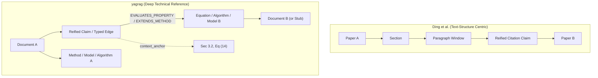

# Integrating Typed Claim Networks and Deep Cross-Document References into yagrag

## 1. Executive Summary

This document evaluates how the concepts introduced by Ding et al. (2026) in *"Reading Between the Citations: A Typed Claim Network for Scientific Literature"* (arXiv:2605.30966) can be adapted and integrated into the `yagrag` (Yet Another GraphRAG) architecture.

Ding et al. demonstrate that collapsing scientific citations into untyped document-to-document edges discards critical evaluative signal (critique, adoption, benchmarking, sentiment/attitude), severely degrading community-level synthesis and retrieval quality. Their approach reifies citation events into **typed claims** anchored to fine-grained textual citation windows (sections and paragraphs) and classifies them across two independent axes:
1. **Stance** (`Critique`, `Adoption`, `Benchmark`, `Neutral`)
2. **Attitude** (`Positive`, `Negative`, `Neutral`)

While Ding et al. build on the Deep Document Model (DDM) to capture text-hierarchy trees ($Paper \rightarrow Section \rightarrow Paragraph \rightarrow Sentence$), `yagrag` adheres to a **Wikidata, not Wikipedia** philosophy: its primary representation bypasses layout-based text parsing to directly model technical domain internals, mathematical structures, and formal entities (`Equation`, `Quantity`, `Algorithm`, `Method`, `Model`, `Assumption`, `Dataset`, `Metric`, `Claim`).

Rather than adopting a heavy text-structure decomposition or importing Ding et al.'s specific taxonomy wholesale, this document proposes:
1. **Deep, Cross-Document Entity References**: Extending `yagrag`'s citation engine beyond coarse `(Document)-[:CITES]->(Document)` edges down to specific domain entities (`Method`, `Equation`, `Algorithm`, `Dataset`, `Metric`, `Model`, `Assumption`) and contextual anchors.
2. **Domain-Agnostic Technical Reference Classification**: A technical relation and claim classification scheme aligned with `yagrag`'s existing ISO GQL schema and MaRDI ontology alignment (`ADOPTS_FORMULATION`, `EXTENDS_METHOD`, `REVISES_ASSUMPTION`, `EVALUATES_PROPERTY`, `BENCHMARKS_AGAINST`, and `BACKGROUND_CONTEXT`).
3. **Decoupled Evaluative Valence**: Decoupling functional technical role (what the reference does mechanically or methodologically) from evaluative valence/attitude (how the target is assessed), avoiding artificial conflation between categories like limitation analysis and sentiment.
4. **Enhanced Clustering and Entity Reuse**: Using deep typed references to disambiguate homonyms, detect duplicate formulations across research papers, resolve conceptual evolution, and cluster technical sub-communities by lineage.

---

## 2. Theoretical Contrast: DDM Text-Hierarchy vs. yagrag Domain-First Modeling

### 2.1 The Ding et al. (arXiv:2605.30966) Paradigm
The architecture of Ding et al. relies on a multi-tier pipeline:
* **Substrate**: Structural parsing of PDFs via `marker` into DDM RDF trees: $Paper \rightarrow Section \rightarrow Paragraph \rightarrow Citation \rightarrow Reference$.
* **Classification Unit**: Paragraph-level citation context windows where source paper $p_s$ invokes target paper $p_t$.
* **Two-Axis Labeling**: Multi-label stance (`Critique`, `Adoption`, `Benchmark`, `Neutral`) and single-label attitude (`Positive`, `Negative`, `Neutral`).
* **Consensus Synthesis & Analytics**: MMR diversification over typed claim buckets to generate balanced literature surveys and weighted PageRank over type-restricted citation subgraphs.

### 2.2 The yagrag Architecture & Constraints
* **Deterministic CLI vs. Agent Reasoning**: The CLI (`kb`) is strictly deterministic, offline, and contains zero LLM calls. All extraction and reasoning reside in the agent layer (`.agents/skills/`).
* **Domain-First Focus**: Technical and research documents are decomposed into concrete domain entities (`Equation` with formal expressions, `Algorithm` with reference implementations or pseudocode, `Quantity` symbols and units, `Method`, `Model`, `Assumption`, `Dataset`, `Metric`).
* **General Technical Applicability**: While `yagrag`'s seed schema includes robotics/state-estimation examples (e.g., `MotionModel`, `StateEstimator`), the architectural patterns and core types (`Document`, `Method`, `Algorithm`, `Equation`, `Model`, `Assumption`, `Quantity`, `Metric`, `Claim`) apply universally across scientific and engineering literature (physics, machine learning, optimization, computational biology, signal processing).
* **Existing Reified `Claim` Pattern**: `yagrag` already supports reified `Claim` nodes (`CREATE NODE TYPE Claim (...)` with `predicate`, `object_literal`, `confidence`, and provenance).
* **Limitations of Pure Text Trees**: In technical and mathematical research, citing prose often targets a specific formal construct (e.g., "Equation 4 in Author et al.", a particular coordinate convention, or a boundary assumption), rather than just referring to the target document as an undifferentiated unit.



---

## 3. Deep References in yagrag: Architecture and Mechanisms

In `yagrag`, cross-document references should not merely stop at the `Document` boundary. Instead, a "deep reference" connects an entity or claim in the citing document directly to the target entity in the cited document (or its stub).

### 3.1 Structural Components of a Deep Reference

A deep reference in `yagrag` consists of three coordinates:
1. **Source Origin**: The citing entity (`Document`, `Method`, `Model`, or `Claim` in $D_{src}$).
2. **Target Domain Entity**: The specific technical entity in $D_{tgt}$ (`Equation`, `Algorithm`, `Quantity`, `Dataset`, `Metric`). If $D_{tgt}$ is only an uningested stub, the target can be an unresolved entity stub or qualified reference string.
3. **Contextual & Structural Qualifier**: When available, a locator string or property indicating section, equation number, or theorem in $D_{tgt}$ (e.g., `section: "III-B"`, `target_label: "Eq. (12)"`, `provenance_quote: "..."`).

### 3.2 Storage in TrueSpar Traverse (GQL Migration)

`yagrag` uses TrueSpar Traverse with versioned GQL migrations. Rather than creating a separate database engine, deep references map naturally into two existing graph constructs:

#### A. Direct Typed Relationship Edges with Qualifiers
For direct structural relations between domain entities across document boundaries:
```gql
-- Proposed edge enhancements in schema migrations
CREATE EDGE TYPE ADOPTS_FORMULATION (
    origin STRING, sources LIST, confidence FLOAT64,
    created_at TIMESTAMP, updated_at TIMESTAMP,
    context STRING, section STRING, target_ref STRING
);

CREATE EDGE TYPE EXTENDS_METHOD (
    origin STRING, sources LIST, confidence FLOAT64,
    created_at TIMESTAMP, updated_at TIMESTAMP,
    context STRING, section STRING, target_ref STRING
);

CREATE EDGE TYPE REVISES_ASSUMPTION (
    origin STRING, sources LIST, confidence FLOAT64,
    created_at TIMESTAMP, updated_at TIMESTAMP,
    aspect STRING, context STRING, target_ref STRING
);

CREATE EDGE TYPE EVALUATES_PROPERTY (
    origin STRING, sources LIST, confidence FLOAT64,
    created_at TIMESTAMP, updated_at TIMESTAMP,
    aspect STRING, context STRING, target_ref STRING
);

CREATE EDGE TYPE BENCHMARKS_AGAINST (
    origin STRING, sources LIST, confidence FLOAT64,
    created_at TIMESTAMP, updated_at TIMESTAMP,
    dataset_id STRING, metric_id STRING, context STRING
);

CREATE EDGE TYPE BACKGROUND_CONTEXT (
    origin STRING, sources LIST, confidence FLOAT64,
    created_at TIMESTAMP, updated_at TIMESTAMP,
    context STRING, section STRING, target_ref STRING
);
```

#### B. Reifying Nuanced Cross-Document Claims Using the Unchanged `Claim` Entity
The existing `Claim` node in `yagrag` is a general reified assertion primitive (`predicate`, `object_literal`, `qualifiers`, linked via `ABOUT` and `HAS_OBJECT`). It is meant for *any* type of claim appearing in a document (e.g., benchmark numbers, convergence assertions, performance metrics) and must not be restricted or altered with mandatory citation-specific fields.

When a cross-document citation involves nuanced arguments, empirical results, or comparative evaluations that require reification beyond a simple typed edge, **the existing `Claim` entity schema is reused completely unchanged**. Citation nuances (such as reference taxonomy and valence) are cleanly encapsulated in the existing `qualifiers` JSON property without altering the node schema:

* `subject`: Citing entity (linked via `ABOUT`, e.g., `Method:meth_new_solver` or `Document:doc_002`)
* `predicate`: Semantic relationship (e.g., `"evaluates_property"`, `"improves_upon"`, `"computational_bottleneck"`, `"relaxes_assumption"`)
* `object`: Cited entity (linked via `HAS_OBJECT`, e.g., `Algorithm:alg_baseline` or `Equation:eq_canonical_update`) or `object_literal`
* `properties`:
  * `name`: Short summary label (e.g., `"Matrix inversion scaling evaluation"`)
  * `summary`: Full contextual quote and finding
  * `qualifiers`: JSON-encoded qualifier map containing contextual citation metadata:
    * `reference_type`: Reference classification category (`ADOPTS_FORMULATION`, `EXTENDS_METHOD`, `REVISES_ASSUMPTION`, `EVALUATES_PROPERTY`, `BENCHMARKS_AGAINST`, `BACKGROUND_CONTEXT`)
    * `attitude`: Valence toward target (`Positive`, `Negative`, `Neutral`)
    * `target_anchor`: Structural locator (`"Section IV-A, Eq. (8)"`)
  * Standard provenance fields: `origin`, `sources`, `confidence`.

##### Comparison: General Domain Claims vs. Citation-Augmenting Claims
Because `Claim` remains completely generic:
1. **General Single-Document Claim** (no citation context needed):
   ```bash
   kb graph upsert-claim claim_drift_01 \
     --subject Method:preint_v2 \
     --predicate "achieves_drift" \
     --object-literal "0.5% per km" \
     --props '{
       "name": "IMU Preintegration Drift",
       "summary": "Achieves 0.5% relative translation drift per kilometer on KITTI sequence 00.",
       "origin": "raw",
       "sources": ["raw-0001"],
       "confidence": 0.95
     }'
   ```
2. **Citation-Augmenting Claim** (reifying a nuanced cross-document critique or evaluation):
   ```bash
   kb graph upsert-claim claim_dense_solver_bottleneck \
     --subject Method:meth_sparse_isam2 \
     --predicate "evaluates_scaling_limit" \
     --object Algorithm:alg_dense_cholesky \
     --props '{
       "name": "Dense solver cubic scaling limit",
       "summary": "Full dense Cholesky factorization incurs O(N^3) scaling as trajectory grows, making batch re-linearization intractable in real-time.",
       "qualifiers": "{\"reference_type\": \"EVALUATES_PROPERTY\", \"attitude\": \"Negative\", \"target_anchor\": \"Section IV-A, Eq. (8)\"}",
       "origin": "raw",
       "sources": ["raw-0005"],
       "confidence": 0.90
     }'
   ```
This preserves the generality of `Claim` across all documents, while allowing rich citation analytics whenever `qualifiers` contain `reference_type`.

---

## 4. Reference Classification Tailored to yagrag

Ding et al. use a 4-class taxonomy (`Critique`, `Adoption`, `Benchmark`, `Neutral`) derived from bibliometric citation-intent literature. While effective for general scientometrics, directly importing it into a technical knowledge base reveals a fundamental structural defect: **`Critique` inherently bundles negative valence with a functional reference type**, while `Adoption` frequently bundles positive valence.

To build a robust, general-purpose representation for technical and research documents across scientific domains, `yagrag` must **strictly decouple technical/functional role from evaluative valence (attitude)**, and provide a clear default fallback category to avoid forced misclassification.

### 4.1 Proposed General Technical Reference Taxonomy

The taxonomy below applies to any technical or scientific literature (e.g., computer science, engineering, physics, applied mathematics). It defines the *functional relationship* between the citing work and the cited element:

| Category | Functional Definition | Typical Target Entities | Cross-Disciplinary Examples |
|---|---|---|---|
| **`ADOPTS_FORMULATION`** | Reuses an exact formal definition, governing equation, coordinate definition, or representation without alteration. | `Equation`, `Quantity`, `Model`, `CoordinateFrame` | • Adopting Navier-Stokes boundary conditions.<br>• Reusing the SE(3) matrix logarithm representation.<br>• Adopting an invariant error definition. |
| **`EXTENDS_METHOD`** | Builds directly upon an existing algorithm, architecture, pipeline, or proof technique by adding components, generalizing steps, or expanding the state/parameter space. | `Method`, `Algorithm`, `System`, `Model` | • Adding online self-calibration to an estimator.<br>• Adding residual connections to an existing backbone architecture.<br>• Generalizing a 1D optimization method to $N$ dimensions. |
| **`REVISES_ASSUMPTION`** | Explicitly questions, modifies, relaxes, or substitutes a theoretical or physical assumption or constraint made in earlier work. | `Assumption`, `Model`, `Constraint` | • Replacing a Gaussian noise assumption with a heavy-tailed Student-t model.<br>• Relaxing planar surface assumptions to 3D uneven topography.<br>• Dropping an independent-and-identically-distributed (i.i.d.) assumption. |
| **`EVALUATES_PROPERTY`** | Formulates a technical analysis, characterization, or investigation of a property (e.g., convergence rate, numerical stability, computational complexity, memory scaling, sensitivity, bias) of the cited artifact. | `Algorithm`, `Equation`, `Model`, `Method`, `Tool` | • Analyzing the $O(N^3)$ computational scaling of a matrix solver.<br>• Investigating asymptotic convergence under non-convex loss.<br>• Characterizing estimator sensitivity to parameter drift. |
| **`BENCHMARKS_AGAINST`** | Quantitatively or experimentally compares performance against the cited work using standardized metrics, tasks, or datasets. | `Algorithm`, `Method`, `Dataset`, `Metric`, `Benchmark` | • Comparing runtime and F1 score against a baseline model on standard datasets.<br>• Comparing mean squared error across benchmark trials. |
| **`BACKGROUND_CONTEXT`** | General attribution, introductory survey, historical positioning, or broad thematic context with no direct mathematical or algorithmic dependency. **(Default Fallback)** | `Concept`, `Document`, `Venue` | • Citing seminal works in an introduction.<br>• Citing standard software packages or survey papers.<br>• Mentioning related problem formulations without adoption or evaluation. |

### 4.2 Decoupling Functional Category from Evaluative Valence (Attitude)

A core flaw in typical citation-intent schemes is conflating *what a reference discusses* with *how the author assesses it*. By decoupling the functional category from the **Attitude (Valence)** axis (`Positive`, `Negative`, `Neutral`), `yagrag` enables complete matrix coverage across all categories:

| Category | Positive Attitude | Negative Attitude | Neutral Attitude |
|---|---|---|---|
| **`EVALUATES_PROPERTY`** | Confirms high stability, bounded error, or computational efficiency under stress. | Identifies bottleneck, asymptotic instability, divergence, or excessive memory footprint (traditional "Critique"). | Objective measurement of scaling, parameter sensitivity analysis, or condition number report without value judgment. |
| **`REVISES_ASSUMPTION`** | Demonstrates that the original assumption is robustly approximated by a simpler surrogate. | Demonstrates that the original assumption is physically violated in realistic environments. | Explores the consequences of varying or relaxing an assumption without asserting superiority. |
| **`BENCHMARKS_AGAINST`** | Notes that the baseline outperforms expectations or sets a competitive bar. | Reports outperforming the baseline or notes baseline failure in edge cases. | Standard tabular comparison reporting metrics side-by-side without evaluative commentary. |
| **`ADOPTS_FORMULATION`** | Commends the formulation for elegance, mathematical consistency, or speed. | Adopts the formulation out of necessity while noting unaddressed edge-case caveats. | Direct verbatim citation and usage of the formula/quantity without commentary. |
| **`EXTENDS_METHOD`** | Praise for the extensible modularity of the foundational method. | Notes that extension was required because the baseline fails to handle core cases. | Standard methodological extension or routine parameter expansion. |
| **`BACKGROUND_CONTEXT`** | Recommends an authoritative survey or foundational textbook. | Mentions that existing surveys overlook a specific sub-area. | Standard introductory citation of prior art (the default state for most references). |

#### Why the `BACKGROUND_CONTEXT` Fallback is Mandatory
In realistic corpus processing, forcing an LLM or human annotator into evaluative bins leads to hallucinated intent or skewed distributions. Over 50% of scientific citations are neutral contextual mentions (as confirmed by Ding et al.'s findings, where 53% of claims were `Neutral`).
* In `yagrag`, when a citation does not exhibit explicit adoption, algorithmic extension, assumption alteration, quantitative benchmarking, or technical property evaluation, it is cleanly classified as `BACKGROUND_CONTEXT` with `Neutral` attitude.
* This fallback prevents polluting the property graph with questionable critiques or phantom adoptions.

---

## 5. Improving Document Clustering and Entity Reuse

A persistent challenge in GraphRAG systems is **entity fragmentation** (duplicate nodes created under slight spelling or notation variations) and **coarse clustering** (documents grouped solely by shared keyword or untyped citation counts). Deep typed references directly address both issues.

### 5.1 Disambiguation and Entity Reuse
1. **LHS/RHS Equation Grounding**: When Document A cites Document B stating *"we use the formulation of [B], Eq. (3)"*, the extraction agent can inspect Document B's `Equation` nodes. If Document B is already ingested, Document A connects directly to the existing `Equation` and its formal symbol definitions (`Quantity`) via `ADOPTS_FORMULATION` rather than creating duplicate nodes.
2. **Subroutine and Component Linking**: Papers frequently reimplement a core algorithm from an earlier work. Instead of registering two independent `Algorithm` nodes, a deep reference sets:
   $$(Algorithm_A) -[:EXTENDS\_METHOD \{context: "\dots"\}]\rightarrow (Algorithm_B)$$
   or links via MaRDI's `SUBCLASS_OF` / `HAS_COMPONENT`.
3. **Targeted Stub Upgrades**: When an external document is cited via `kb doc cite`, `yagrag` creates a `Document` stub. Deep references allow creating **entity stubs** (e.g., `Equation(origin="stub", name="Lie Group SE(3) Right Jacobian")`). When that paper is subsequently ingested, existing references automatically resolve to the newly extracted formal entity.

### 5.2 Deep Topological Clustering
With deep typed references, clustering algorithms (such as Louvain or InfoMap) and centrality analytics do not operate on a flat citation graph. Instead:
* **Algorithmic Lineage Clusters**: Projecting the graph along `ADOPTS_FORMULATION` and `EXTENDS_METHOD` reveals true algorithmic descent across research generations.
* **Controversy & Degeneracy Hotspots**: Computing polarity scores $\rho(t) = \frac{n_{pos}(t) - n_{neg}(t)}{n_{total}(t)}$ specifically over `EVALUATES_PROPERTY` or `REVISES_ASSUMPTION` subgraphs highlights contested formulations or fragile assumptions without conflating them with benchmark victories.
* **Cross-Paradigm Bridges**: Identifying nodes that link via `BENCHMARKS_AGAINST` across distinct formulation clusters isolates key comparative bridge studies.

---

## 6. Implementation Strategy in yagrag

Implementing these ideas in `yagrag` must preserve its architectural invariants: **deterministic CLI, LLM reasoning in the agent**.

### 6.1 Deterministic CLI Extensions (`kb`)
The CLI requires no internal LLMs. It requires schema support and mechanical helpers:
1. **Schema Migration**: Add new relationship types (`ADOPTS_FORMULATION`, `EXTENDS_METHOD`, `REVISES_ASSUMPTION`, `EVALUATES_PROPERTY`, `BENCHMARKS_AGAINST`, `BACKGROUND_CONTEXT`) and edge properties (`section`, `target_ref`, `aspect`) to `schema/migrations/`.
2. **CLI Command Enhancements**:
   * Extend `kb graph upsert-edge` and `kb doc cite`:
     ```bash
     # Specific property evaluation edge
     kb graph upsert-edge EVALUATES_PROPERTY --from Method:meth_ptv2 --to Method:meth_ptv1 \
       --props '{"aspect": "memory_scaling", "section": "IV-B", "origin": "raw", "sources": ["doc_ptv2"]}'

     # General background/context citation fallback
     kb graph upsert-edge BACKGROUND_CONTEXT --from Document:doc_002 --to Document:doc_001 \
       --props '{"section": "Introduction", "origin": "raw", "sources": ["doc_002"]}'
     ```
   * Extend `kb graph lint`:
     Add lint checks ensuring that typed reference edges reference valid entities and carry non-empty provenance. For reified `Claim` nodes, standard claims require no citation fields; if a `Claim` includes `reference_type` or `attitude` within its `qualifiers`, linting validates that they match allowed enum values.
   * Add typed citation analytics to `kb graph` (e.g., `kb graph lineage <entity_id>` or `kb graph consensus <entity_id>`).

### 6.2 Agent Layer Workflow (`deep-knowledge-extraction` Skill)
The reasoning burden is placed on the agent skill:
1. **Extraction Step**: During `deep-knowledge-extraction`, when analyzing citations in the text, the agent classifies the citation along two decoupled dimensions:
   * **Functional Reference Type**: One of `ADOPTS_FORMULATION`, `EXTENDS_METHOD`, `REVISES_ASSUMPTION`, `EVALUATES_PROPERTY`, `BENCHMARKS_AGAINST`, or `BACKGROUND_CONTEXT`.
   * **Attitude (Valence)**: `Positive`, `Negative`, or `Neutral`.
   * **Default Fallback Rule**: If the citation is merely contextual, introductory, or cannot be confidently mapped to a specific technical dependency or evaluation, the agent MUST assign `BACKGROUND_CONTEXT` with `Neutral` attitude.
2. **Target Resolution**: The agent queries the existing graph (`kb search` or `kb graph query`) to see if the referenced equation, algorithm, or model already exists.
3. **Atomic Batch Ingestion**: The agent outputs structured operations into `kb graph batch`. For a nuanced assertion, it uses the unchanged `Claim` entity with `qualifiers`:
   ```json
   {
     "op": "claim",
     "id": "claim_solver_scaling_bottleneck",
     "subject": "Algorithm:alg_sparse_solver",
     "predicate": "evaluates_scaling_limit",
     "object": "Algorithm:alg_dense_cholesky",
     "props": {
       "name": "Dense solver cubic scaling limit",
       "summary": "Full dense factorization incurs O(N^3) complexity on high-dimensional state vectors, motivating sparse band-diagonal solvers.",
       "qualifiers": "{\"reference_type\": \"EVALUATES_PROPERTY\", \"attitude\": \"Negative\"}",
       "origin": "raw",
       "sources": ["raw-0005"]
     }
   }
   ```
   Or for a direct contextual fallback using a typed edge:
   ```json
   {
     "op": "edge",
     "rel": "BACKGROUND_CONTEXT",
     "from": "Document:raw-0005",
     "to": "Document:raw-0001",
     "props": {
       "context": "Cited in Section 1 as standard introductory literature on convex optimization.",
       "origin": "raw",
       "sources": ["raw-0005"]
     }
   }
   ```

---

## 7. Comparison Matrix: Approaches to Inter-Document References

| Feature | Standard GraphRAG | Ding et al. (arXiv:2605.30966) | Proposed yagrag Deep References |
|---|---|---|---|
| **Primary Graph Unit** | Chunk co-occurrence / Global entities | Reified citation claims between papers | Mathematical & algorithmic domain entities + reified claims |
| **Document Granularity** | Text chunks (200–500 tokens) | Paper $\rightarrow$ Section $\rightarrow$ Paragraph | Raw document $\rightarrow$ Equations, Models, Algorithms, Quantities |
| **Citation Target** | Coarse Document node | Coarse Document node (with paragraph provenance) | Fine-grained Entity (`Equation`, `Method`, `Assumption`, etc.) or Document node |
| **Taxonomy** | None (untyped edges) | 4-class Stance (`Critique`, `Adoption`, `Benchmark`, `Neutral`) + 3-class Attitude | Functional Intent (`ADOPTS_FORMULATION`, `EXTENDS_METHOD`, `REVISES_ASSUMPTION`, `EVALUATES_PROPERTY`, `BENCHMARKS_AGAINST`, `BACKGROUND_CONTEXT`) strictly decoupled from Attitude (`Positive`, `Negative`, `Neutral`) |
| **Default Fallback** | N/A (all edges uniform) | `Neutral` stance | Explicit `BACKGROUND_CONTEXT` edge / category preventing forced evaluative misclassification |
| **Mathematical Grounding** | None | None | SymPy expressions, Python AST verification, parameter units |
| **Inference Cost** | High (full-corpus LLM graph construction) | Low (per-pair context LLM extraction) | Zero LLM in CLI; one-pass extraction in agent workflow |

---

## 8. Conclusion and Next Steps

The insights from Ding et al. (arXiv:2605.30966) demonstrate that typed, evaluative reference structures provide significant advantages over flat vector retrieval for consensus generation, literature synthesis, and structural analytics.

By adapting these principles to `yagrag`'s domain-first, mathematically-grounded property graph, `yagrag` can capture not just *that* paper A cites paper B, but *how* an algorithm in paper A modifies an equation from paper B to eliminate a specific physical or computational assumption.

### Recommended Next Steps:
1. **Schema Migration**: Draft migration `0006_deep_typed_references.gql` defining the six decoupled technical citation edge types (`ADOPTS_FORMULATION`, `EXTENDS_METHOD`, `REVISES_ASSUMPTION`, `EVALUATES_PROPERTY`, `BENCHMARKS_AGAINST`, `BACKGROUND_CONTEXT`) and their contextual properties.
2. **Skill Update**: Update `.agents/skills/deep-knowledge-extraction/SKILL.md` to instruct the agent to classify citations along the two decoupled axes (functional intent and evaluative attitude), with strict adherence to the `BACKGROUND_CONTEXT` default fallback when citations are non-specific.
3. **Validation**: Test the pattern across technical documents from multiple domains (e.g., optimization solvers, machine learning architectures, and state estimators) to verify that the taxonomy generalizes cleanly beyond a single field.
