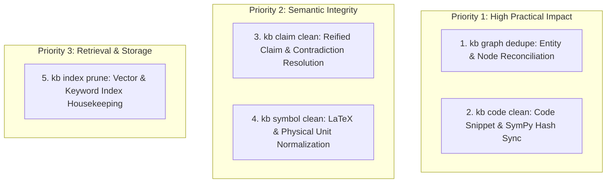

# Feature Proposal: Post-Ingestion Maintenance & Cleanup Commands

## 1. Executive Summary & Design Philosophy

In the GraphRAG knowledge base architecture, document ingestion and knowledge extraction are intentionally **non-blocking and additive**:
* Ingestion must never fail or block due to minor formatting quirks, slight title variations, or unlinked references.
* Documents and entities are ingested rapidly with full provenance intact.

To prevent entropy and fragmentation over time as dozens of papers enter the collection, the system employs **post-ingestion maintenance passes**:
1. **Additive Ingestion**: Captures knowledge without rigid constraints.
2. **Reviewable Maintenance Passes**: Cleanup commands default to `--dry-run` inspection before applying changes with `--apply`.
3. **Schema-Agnostic Execution**: Algorithms operate on generic schema capability contracts (provenance arrays, symbol properties, checkable code properties, and reified claims) rather than hardcoded domain vocabularies.

---

## 2. Prioritized Cleanup Commands



---

### Priority 1: High Practical Impact

#### 1. `kb graph dedupe` — Entity & Node Reconciliation
* **Target Layer**: Layer 3 (Domain Entities) & Layer 1 (Bibliographic Entities).
* **Problem**: Different papers refer to the same real-world entity under slightly different names or slugs (e.g., `Tool:gtsam` vs. `Tool:tool_gtsam_lib`, `Dataset:kitti_odometry` vs. `Dataset:dataset_kitti_2012`, `Robot:husky_a200` vs. `Robot:clearpath_husky`).
* **Capabilities**:
  * Scans across each node table for candidate duplicate clusters based on token Jaccard overlap, slug matching, or shared symbols.
  * Selects the canonical node based on graph degree and metadata completeness.
  * Re-routes all incoming and outgoing edges (`USES`, `EVALUATED_ON`, `IMPLEMENTS`, `ABOUT`) to the canonical node.
  * Merges `sources` lists (strict union) and aggregates `summary` descriptions.
  * Prunes the redundant duplicate nodes.
* **CLI Syntax**:
  ```bash
  kb graph dedupe [--label <NodeType>] [--threshold 0.85] [--dry-run | --apply]
  ```

#### 2. `kb code clean` — Snippet Path, Entry Point & Hash Synchronization
* **Target Layer**: Layer 3 (Code & Equations).
* **Problem**: As snippet files are moved into paper-namespaced subdirectories (e.g. `code/algorithms/raw-0005/`), edited, or renamed, snippet hashes become `stale`, or `code_path` references point to obsolete locations.
* **Capabilities**:
  * Scans all statically checkable nodes (`code_*` properties).
  * Automatically resolves active file paths on disk by matching entry point function names or content hashes.
  * Updates `code_path` and `code_entry` to active locations.
  * Re-computes `code_hash`, executes AST/SymPy syntax checks, and updates `code_status = "ok"`.
  * Flags or removes orphan snippet files in `code/` that are no longer referenced by any graph node.
* **CLI Syntax**:
  ```bash
  kb code clean [--dry-run | --apply]
  ```

---

### Priority 2: Semantic Integrity & Scientific Quality

#### 3. `kb claim clean` — Reified Claim Normalization & Contradiction Detection
* **Target Layer**: Layer 2 (Reified Claims).
* **Problem**: Ingested claims may carry predicate naming variations (e.g., `outperforms` vs. `OUTPERFORMS`), sentence-length text in `name` instead of `summary`, or unlinked conflicting quantitative results across papers.
* **Capabilities**:
  * **Predicate Canonicalization**: Lowercases and standardizes predicate verbs.
  * **Title/Summary Split**: Moves full assertion sentences from `name` to `summary` and generates concise title labels.
  * **Contradiction Detection**: Flags claims sharing identical subjects and predicates with divergent quantitative objects.
* **CLI Syntax**:
  ```bash
  kb claim clean [--dry-run | --apply]
  ```

#### 4. `kb symbol clean` — LaTeX & Physical Unit Normalization
* **Target Layer**: Layer 3 (Mathematical & Physical Symbols).
* **Problem**: Quantities and variables frequently suffer from LaTeX escaping glitches (e.g., `\mu` vs `\\mu` vs `mu`), concatenated variable strings, or inconsistent unit formats (`m/s` vs `meter/sec` vs `m s^-1`).
* **Capabilities**:
  * Normalizes LaTeX symbol formatting (e.g., standardizing `\omega_z`, `\theta`, `\phi`, `B_s`).
  * Standardizes SI physical units (`m/s`, `rad/s`, `N`, `N/rad`, dimensionless `"-"`).
  * Validates symbol occurrences against connected `EXPRESSED_BY` and `USES_SYMBOL` equations.
* **CLI Syntax**:
  ```bash
  kb symbol clean [--dry-run | --apply]
  ```

---

### Priority 3: Retrieval & Housekeeping

#### 5. `kb index prune` — Search Index & Vector Housekeeping
* **Target Layer**: Retrieval & Embedding Indices.
* **Problem**: Merging, renaming, or pruning nodes during graph maintenance passes leaves stale vector chunks in the search index.
* **Capabilities**:
  * Purges orphaned vector embeddings for retired nodes or merged stubs.
  * Rebuilds embeddings for nodes whose `name` or `summary` changed during cleanup passes.
  * Optimizes the index directory footprint.
* **CLI Syntax**:
  ```bash
  kb index prune [--dry-run | --apply]
  ```

---

## 3. Implementation Roadmap

| Step | Command | Status | Target Module |
|---|---|---|---|
| **Step 1** | `kb doc clean` | **Implemented** | `kb/cli/doc_cmd.py` |
| **Step 2** | `kb graph dedupe` | **In Progress** | `kb/cli/graph_cmd.py` |
| **Step 3** | `kb code clean` | Planned | `kb/cli/code_cmd.py` |
| **Step 4** | `kb claim clean` | Planned | `kb/cli/graph_cmd.py` |
| **Step 5** | `kb symbol clean` | Planned | `kb/cli/graph_cmd.py` |
| **Step 6** | `kb index prune` | Planned | `kb/cli/index_cmd.py` |
