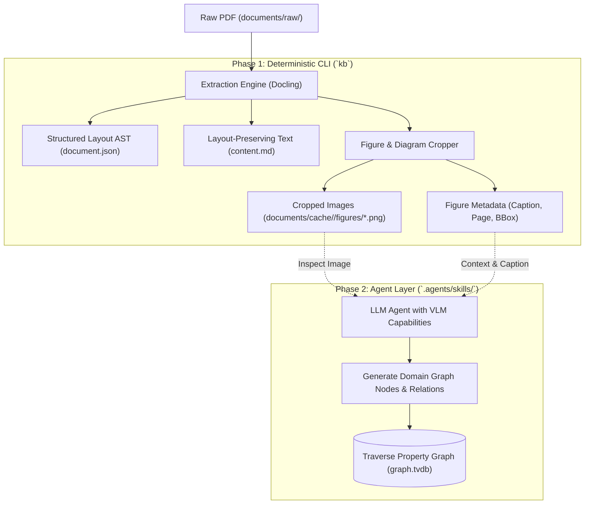

# Proposal: Improved Document & Diagram Extraction Architecture

## 1. Executive Summary & Problem Context

In `yagrag`, the current document ingestion and extraction pipeline treats PDF handling as an on-demand, in-memory operation:
- `DocumentStore.extract_text(doc_id)` in `kb/store/documents.py` dynamically invokes `pypdf.PdfReader` whenever text is needed (e.g., during `kb doc text` or `kb index build`).
- **Zero intermediate caching**: Every execution of `kb index build` or `kb doc text` re-parses the multi-page PDF from scratch.
- **Loss of structural, mathematical, and visual fidelity**: `pypdf` performs basic stream-level text chunking. It scrambles multi-column layouts, strips tables, flattens LaTeX equations into garbled character strings, and completely discards visual assets (diagrams, architecture charts, factor graphs, and figures).
- **Missed technical context**: In technical research (robotics, state estimation, control, optimization, physics), crucial system architectures, coordinate frames, factor graphs, and algorithm flows are communicated visually in diagrams rather than solely in text.

This document outlines an improved extraction architecture for `yagrag`. It evaluates contemporary extraction backends—highlighting **[Docling](https://github.com/docling-project/docling)** (IBM Granite Docling model family)—and specifies:
1. An **intermediate storage & caching subsystem** (`documents/cache/<doc_id>/`) that avoids repetitive parsing while remaining excluded from Git for copyright hygiene.
2. A **diagram extraction and visual artifact pipeline** that crops and exports figures and tables for agent inspection using Vision-Language Models (VLMs).
3. A **tiered, plugin-based backend design** maintaining `yagrag`'s strict core invariant: a fast, lightweight, deterministic CLI with heavy ML backends packaged cleanly as optional extras.

---

## 2. Evaluation of PDF Extraction Alternatives

To balance runtime speed, dependency weight, layout comprehension, mathematical recovery, and diagram extraction, we evaluate the primary extraction alternatives against `yagrag`'s requirements.

| Extractor / Pipeline | Layout & Reading Order | Math & Table Quality | Diagram / Figure Cropping | Execution Speed & Resource Footprint | Dependencies & Licensing | Recommendation for `yagrag` |
|---|---|---|---|---|---|---|
| **`pypdf`** *(Current)* | Poor (linear byte-stream order; breaks on 2-column papers) | Poor (no table structures; math characters garbled) | None (extracts raw text streams only) | Extremely fast (<0.1s/doc); minimal memory (<20MB) | Pure Python, MIT license, zero heavy dependencies | Retain as **Tier 1 (Fallback / Baseline)** for minimal environments and CI tests. |
| **PyMuPDF (`fitz`)** | Moderate (basic layout blocks and sorting) | Basic (bounding-box heuristics; poor LaTeX recovery) | Fast bitmap extraction, but lacks semantic figure/caption boundary detection | Very fast (<0.5s/doc); low memory (<50MB) | C-bindings, **AGPL-3.0 / Commercial** (licensing risk for permissive distribution) | Avoid as primary dependency due to AGPL licensing constraints. |
| **`pdfplumber` / `pdfminer.six`** | Moderate (character-level bounding boxes) | Good for bordered tables; poor for LaTeX equations | Bounding-box coordinate extraction, but no semantic diagram categorization | Slow (pure Python parsing of glyph streams) | Pure Python, MIT license | Useful for targeted table extraction, but insufficient for unified layout + visual diagram extraction. |
| **Marker** | High (surfaces clean Markdown with LaTeX equations) | High (heuristics + Nougat-derived vision models) | Extracts image blocks, but oriented strictly toward single-file markdown | Moderate–Slow; requires PyTorch + HuggingFace checkpoints | Heavy PyTorch, GPL-3.0 / restrictive licenses on certain model weights | Powerful for academic markdown, but less modular for granular object-level figure/caption pairing. |
| **Grobid** | High (specifically trained on academic preprints: TEI-XML) | Moderate for math; excellent for bibliographic metadata | Basic figure coordinate detection in TEI-XML | Fast (Java daemon), but requires persistent background process | Java 17+ server requirement; Docker container needed | Too heavy operational burden for a local-first, single-binary Python CLI. |
| **Docling** *(Proposed)* | **Superior** (DocLayNet-trained layout models, unified JSON document model) | **Superior** (TableFormer for complex tables, native LaTeX formula recognition) | **Native visual asset cropping**, figure-caption association, bounding-box provenance | Moderate (runs local ONNX / PyTorch models; ~1–3s/page CPU, sub-second on GPU) | Python native, **MIT License**, modular backend (Docling-core + Docling) | **Adopt as Tier 2 (Preferred Engine)** via `pip install .[docling]`. |

### Why Docling Fits `yagrag`
1. **Permissive Open-Source Licensing**: Docling is released under the MIT License by IBM Research, making it fully compatible with `yagrag`'s MIT license.
2. **Unified Structural Data Model (`DoclingDocument`)**: Docling decomposes documents into a semantic tree: headings, paragraphs, code snippets, tables (exported as Markdown, HTML, or pandas DataFrames), formulas (exported as LaTeX), and picture/figure items. This directly matches `yagrag`'s schema entities (`Equation.latex`, `Table`, `Figure`).
3. **Native Figure & Diagram Handling**: Docling identifies figure boundaries, pairs them with their textual captions, and can automatically export cropped image files (`.png`) alongside the text.
4. **Deterministic Local Inference**: Can run completely offline using local weights without external API calls, preserving `yagrag`'s offline, air-gapped capability.

---

## 3. Storage & Caching Architecture

### 3.1 The Invalidation & Provenance Problem
Currently, raw documents live in `documents/raw/<filename>`. Re-extracting text on every query wastes CPU cycles and creates non-deterministic latency. However, derivative text and extracted images must not clutter source control or violate copyright constraints.

### 3.2 The Dedicated Cache Directory (`documents/cache/<doc_id>/`)
Extracted representations are stored in a dedicated, isolated cache directory partitioned by `doc_id`. This directory is **excluded from Git by default** (`.gitignore`), while remaining easily archivable or inspectable locally.

```text
<kb-root>/
├── .gitignore                      # Includes "documents/cache/"
├── kb.toml                         # Document store & extractor config
├── documents/
│   ├── manifest.json               # Canonical index (tracks raw hashes and cache status)
│   ├── raw/
│   │   └── raw-0001_2505.00200v2.pdf  # Immutable raw source
│   └── cache/                      # Ignored by git; populated by `kb doc parse` / on-demand
│       └── raw-0001/
│           ├── meta.json           # Cache manifest (extractor name, version, hash, timestamp)
│           ├── content.md          # Clean, layout-aware Markdown representation
│           ├── document.json       # Lossless structural AST (DoclingDocument JSON)
│           └── figures/            # Cropped visual assets and diagrams
│               ├── fig_01_p03.png  # Figure 1: Block diagram / Kinematic model
│               ├── fig_01.meta.json# Bounding box, page number, caption text
│               ├── fig_02_p05.png  # Figure 2: Factor graph formulation
│               └── fig_02.meta.json
```

### 3.3 Cache Metadata & Invalidation Protocol (`meta.json`)
To guarantee that cached artifacts never fall out of sync with the underlying raw file or engine configuration, every cache entry carries a `meta.json`:

```json
{
  "doc_id": "raw-0001",
  "source_hash": "e3b0c44298fc1c149afbf4c8996fb92427ae41e4649b934ca495991b7852b855",
  "extractor": "docling",
  "extractor_version": "2.12.0",
  "extracted_at": "2026-09-20T10:15:30Z",
  "has_figures": true,
  "figure_count": 4,
  "tables_count": 2,
  "equations_count": 14
}
```

**Invalidation Rules**:
1. When `kb doc text <id>`, `kb doc parse <id>`, or `kb index build` is called:
   - Compute current SHA-256 of `documents/raw/<path>`.
   - If `documents/cache/<id>/meta.json` exists and `source_hash == current_hash`, read directly from cache.
   - If the cache is missing, stale, or generated by an older incompatible extractor version, automatically invalidate and trigger a clean parse.
2. CLI commands:
   - `kb doc clean --cache`: Purge cached files across all documents.
   - `kb doc parse <id> [--force] [--extractor docling|pypdf]`: Explicitly parse or re-parse a document.

---

## 4. Diagram & Visual Content Extraction

Technical diagrams (factor graphs, kinematic chains, neural architectures, control loops, electrical schematics) contain structural relationships that prose often leaves implicit.

### 4.1 Two-Phase Diagram Extraction Workflow



### 4.2 Phase 1: Deterministic Extraction in `kb` CLI
During parsing, Docling's layout engine classifies page regions (`Picture`, `Figure`, `Table`, `Caption`).
For every item classified as a figure or diagram:
1. Crop the bounding box directly from the high-resolution page rendering (default 150–200 DPI).
2. Save the image as `documents/cache/<id>/figures/fig_<index>_p<page>.png`.
3. Locate the associated `Caption` block and persist sidecar metadata:
   ```json
   {
     "id": "fig_02",
     "page": 4,
     "bbox": [72.0, 140.5, 520.0, 480.0],
     "caption": "Figure 2: Factor graph representation of the proposed skid-steer visual-inertial odometry.",
     "image_path": "documents/cache/raw-0001/figures/fig_02_p04.png"
   }
   ```
4. Insert an inline reference into `content.md`:
   ```markdown
   
   ```

### 4.3 Phase 2: Agent VLM Interpretation
In accordance with `yagrag`'s strict core philosophy—**no LLM/VLM calls inside the CLI**—the CLI only produces the cropped images and metadata. The semantic interpretation of diagrams belongs entirely in the agent layer:
- The `deep-knowledge-extraction` skill is extended:
  1. The agent lists available figures via `kb doc figures <doc_id> --json`.
  2. For diagrams of interest (e.g., matching keywords like "factor graph", "architecture", "kinematics"), the agent inspects the image file using multimodal tooling (`view_image`).
  3. The agent extracts domain nodes (`FactorGraph`, `Variable`, `Factor`, `MotionModel`, `CoordinateFrame`) and connects them directly to the graph via `kb graph batch`.

---

## 5. Architectural Design & Implementation Plan

### 5.1 Pluggable Extractor Interface in `kb`
We define a clean abstract interface in `kb/store/extractors/base.py`:

```python
from abc import ABC, abstractmethod
from dataclasses import dataclass
from pathlib import Path
from typing import Any

@dataclass
class ExtractedFigure:
    fig_id: str
    page: int
    bbox: list[float]
    caption: str
    image_bytes: bytes
    format: str = "png"

@dataclass
class ExtractionResult:
    text: str
    markdown: str
    metadata: dict[str, Any]
    figures: list[ExtractedFigure]
    tables: list[dict[str, Any]]
    raw_ast: dict[str, Any] | None = None

class DocumentExtractor(ABC):
    @property
    @abstractmethod
    def name(self) -> str:
        """Unique identifier of the extractor (e.g., 'pypdf', 'docling')."""

    @abstractmethod
    def is_available(self) -> bool:
        """Check if dependencies for this extractor are installed."""

    @abstractmethod
    def extract(self, path: Path, extract_figures: bool = True) -> ExtractionResult:
        """Parse source document into structured text, markdown, and visual assets."""
```

### 5.2 Tiered Extractor Strategy
1. **`DoclingExtractor` (`kb/store/extractors/docling.py`)**:
   - Primary high-fidelity extractor.
   - Requires `pip install .[docling]` (`docling>=2.0.0`).
   - Uses PyTorch / ONNX for layout analysis, TableFormer for tables, and generates Markdown with LaTeX math syntax.
   - Extracts cropped figures with coordinates and captions.
2. **`PyPdfExtractor` (`kb/store/extractors/pypdf.py`)**:
   - Zero-overhead fallback extractor.
   - Fast, purely textual extraction. Returns empty figure list.
   - Ensures `yagrag` installs cleanly in lightweight dev setups, containers, and minimal CI runners without GPU or PyTorch dependencies.

### 5.3 Configuration via `kb.toml`
The knowledge base configuration specifies extractor preferences:

```toml
[documents]
raw = "documents/raw"
synthesized = "documents/synthesized"
cache = "documents/cache"
# Extractor preference: "auto" (uses docling if installed, falls back to pypdf),
# "docling", or "pypdf"
extractor = "auto"
extract_figures = true
figure_dpi = 150
```

---

## 6. Migration & Rollout Strategy

1. **Step 1: Extractor Interface & Caching Core**
   - Create `kb/store/cache.py` managing `documents/cache/<doc_id>/`.
   - Update `.gitignore` in repository template to ignore `documents/cache/`.
   - Implement `DocumentExtractor` abstract base class and migrate existing `pypdf` logic into `PyPdfExtractor`.
   - Wire `DocumentStore.extract_text` to check the cache before invoking the extractor.

2. **Step 2: Optional Dependency Packaging**
   - Update `pyproject.toml` with optional dependencies:
     ```toml
     [project.optional-dependencies]
     docling = ["docling>=2.0.0"]
     all = ["traverse-embedded>=0.8.2", "fastembed>=0.3.0", "sympy>=1.12", "docling>=2.0.0"]
     ```

3. **Step 3: Docling Implementation & Figure Export**
   - Implement `DoclingExtractor`.
   - Export cropped diagrams to `documents/cache/<doc_id>/figures/`.
   - Add CLI subcommands:
     - `kb doc parse <id>`: Parse and populate cache.
     - `kb doc figures <id>`: List extracted figures and display caption metadata.

4. **Step 4: Agent Skill Integration**
   - Update `.agents/skills/deep-knowledge-extraction/SKILL.md`:
     - Instruct the agent to run `kb doc figures <id>` when analyzing architectural or mathematical sections.
     - Add visual inspection guidelines for translating block diagrams and factor graphs into property-graph entities.

---

## 7. Conclusion

Adopting **Docling** as an optional high-fidelity extraction backend—coupled with a dedicated, git-ignored **cache directory** and **visual figure cropping**—resolves `yagrag`'s most prominent ingestion bottlenecks:
- It eliminates the high latency of on-the-fly re-parsing.
- It elevates text fidelity from plain ASCII streams to structured Markdown with preserved tables and LaTeX formulas.
- It opens the knowledge base to multimodal visual extraction, allowing agents to ground property-graph entities directly in the structural diagrams and factor graphs of scientific papers.
